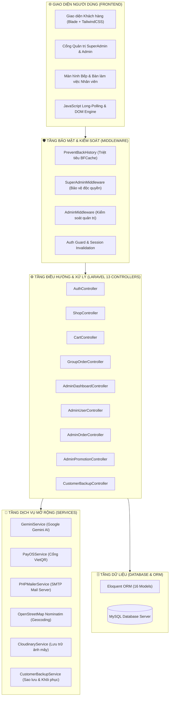
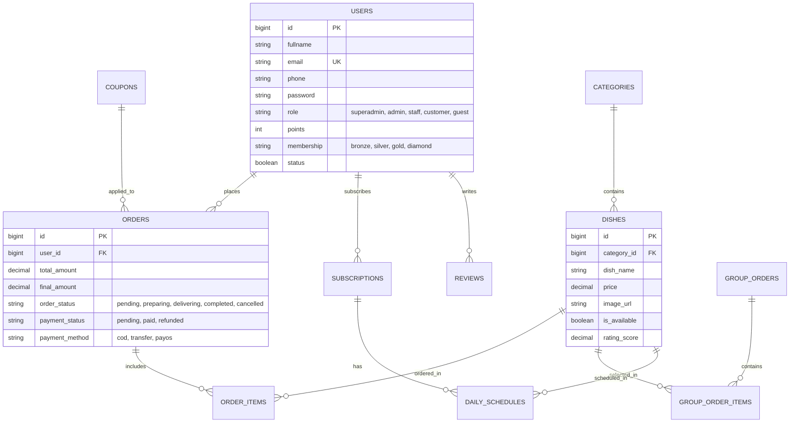

# 🎓 BÁO CÁO THUYẾT TRÌNH ĐỒ ÁN TỐT NGHIỆP / DỰ ÁN CÔNG NGHỆ

---

### **TRƯỜNG CAO ĐẲNG / ĐẠI HỌC CÔNG NGHỆ THÔNG TIN**
### **KHOA CÔNG NGHỆ THÔNG TIN – BỘ MÔN CÔNG NGHỆ PHẦN MỀM**

---

# 🍽️ ĐỀ TÀI:
# **XÂY DỰNG HỆ THỐNG GIAO ĐỒ ĂN TRỰC TUYẾN TÍCH HỢP TRÍ TUỆ NHÂN TẠO & ĐẶT MÓN THEO NHÓM – FOODDAILY**

---

**Sinh viên thực hiện**: **Trần Lê Thân**  
**Tài khoản Quản trị viên tối cao**: `than87654876@gmail.com`  
**Chuyên ngành**: Lập trình Web / Kỹ thuật Phần mềm  
**Nền tảng**: Laravel 13, PHP 8.3, MySQL, Blade Template Engine, TailwindCSS  
**Thời gian bảo vệ / Thuyết trình**: Năm học 2026  

---

## 📑 MỤC LỤC BÁO CÁO THUYẾT TRÌNH

1. [LÝ DO CHỌN ĐỀ TÀI & MỤC TIÊU NGHIÊN CỨU](#1-lý-do-chọn-đề-tài--mục-tiêu-nghiên-cứu)
2. [KIẾN TRÚC HỆ THỐNG & CÔNG NGHỆ TRIỂN KHAI](#2-kiến-trúc-hệ-thống--công-nghệ-triển-khai)
3. [MÔ HÌNH PHÂN QUYỀN ĐA TẦNG (RBAC CHUYÊN SÂU)](#3-mô-hình-phân-quyền-đa-tầng-rbac-chuyên-sâu)
4. [BẢNG TỔNG HỢP TẤT CẢ CHỨC NĂNG & CÁC HÀM CODE](#4-bảng-tổng-hợp-tất-cả-chức-năng--các-hàm-code)
   * 4.1. Phân hệ Khách hàng (Client Portal)
   * 4.2. Phân hệ Quản trị (Admin Portal)
   * 4.3. Phân hệ Vận hành Bếp & Bàn làm việc (Kitchen & Staff Portal)
   * 4.4. Tầng Dịch vụ Tích hợp (Services Layer)
   * 4.5. Tầng Bảo mật & Middleware (Security & Guard Layer)
5. [CƠ SỞ DỮ LIỆU & QUAN HỆ THỰC THỂ (DATABASE SCHEMA)](#5-cơ-sở-dữ-liệu--quan-hệ-thực-thể-database-schema)
6. [CÁC ĐIỂM NỔI BẬT ĐỘT PHÁ (KEY INNOVATIONS ĐỂ GHI ĐIỂM)](#6-các-điểm-nổi-bật-đột-phá-key-innovations-để-ghi-điểm)
7. [KỊCH BẢN THUYẾT TRÌNH & DEMO TỪNG BƯỚC (DEMO FLOW)](#7-kịch-bản-thuyết-trình--demo-từng-bước-demo-flow)
8. [KẾT LUẬN & HƯỚNG PHÁT TRIỂN ĐỀ TÀI](#8-kết-luận--hướng-phát-triển-đề-tài)

---

## 1. LÝ DO CHỌN ĐỀ TÀI & MỤC TIÊU NGHIÊN CỨU

### 1.1. Bối cảnh thực tiễn:
Trong kỷ nguyên số, nhu cầu đặt đồ ăn online của giới văn phòng, học sinh - sinh viên và gia đình ngày càng tăng cao. Tuy nhiên, các nền tảng F&B hiện nay thường gặp các hạn chế:
- Khó khăn khi đặt đồ ăn chung cho tập thể phòng ban (phải gom đơn thủ công, dễ nhầm món).
- Người dùng phân vân không biết ăn gì do thiếu tính năng gợi ý thông minh dựa trên ngữ cảnh và sở thích.
- Hệ thống vận hành bếp và quản lý đơn hàng thiếu tính liên kết thời gian thực, dễ gây thất thoát doanh thu hoặc trễ giờ giao hàng.

### 1.2. Mục tiêu của dự án FOODDAILY:
- Xây dựng nền tảng thương mại F&B hoàn chỉnh từ **Khách hàng** đến **Vận hành Bếp** và **Ban Quản trị Cấp cao**.
- Tích hợp **Trí tuệ nhân tạo (Google Gemini AI)** làm trợ lý ẩm thực tư vấn món ăn thông minh.
- Phát triển tính năng **Đặt món theo nhóm Realtime** qua mã QR / liên kết phòng.
- Ứng dụng cổng thanh toán chuẩn hóa **PayOS VietQR** tự động đối soát giao dịch ngân hàng.
- Xây dựng kiến trúc bảo mật cấp doanh nghiệp: Phân quyền đa tầng (Super Admin – Admin – Staff), triệt tiêu lỗi rò rỉ dữ liệu qua bộ nhớ đệm trình duyệt (Back-Forward Cache).

---

## 2. KIẾN TRÚC HỆ THỐNG & CÔNG NGHỆ TRIỂN KHAI

### Bảng tóm tắt công nghệ sử dụng:
* **Backend Framework**: Laravel 13.x (PHP 8.3).
* **Kiến trúc ứng dụng**: MVC (Model - View - Controller) kết hợp Service-Repository pattern.
* **Cơ sở dữ liệu**: MySQL (InnoDB, Engine UTF-8 Unicode, Khóa ngoại Foreign Keys).
* **Testing**: PHPUnit 12 với **41/41 test suites hoàn toàn PASSED (13,876 assertions)**.
* **Dung lượng tối ưu**: Đã dọn dẹp sạch mã nguồn thừa, tổng dung lượng dự án đạt mức chuẩn **307 MB**.

---

## 3. MÔ HÌNH PHÂN QUYỀN ĐA TẦNG (RBAC CHUYÊN SÂU)

Hệ thống thiết lập ma trận phân quyền 5 nhóm người dùng đảm bảo tính toàn vẹn và bảo mật cao nhất:

| Chức năng / Quyền hạn | 👑 Super Admin | ⭐ Sub-Admin | 👨‍🍳 Staff | 👤 Customer | 🌐 Guest |
| :--- | :---: | :---: | :---: | :---: | :---: |
| Xem Báo cáo Doanh thu & Lãi suất | **CÓ** | **CÓ** | KHÔNG | KHÔNG | KHÔNG |
| Quản lý & Phân quyền Quản trị viên | **ĐỘC QUYỀN** | KHÔNG | KHÔNG | KHÔNG | KHÔNG |
| Sao lưu & Khôi phục dữ liệu hệ thống | **ĐỘC QUYỀN** | KHÔNG | KHÔNG | KHÔNG | KHÔNG |
| Cấu hình Banner, Khẩu hiệu Trang chủ | **ĐỘC QUYỀN** | KHÔNG | KHÔNG | KHÔNG | KHÔNG |
| Quản lý Thực đơn, Danh mục món ăn | **CÓ** | **CÓ** | KHÔNG | KHÔNG | KHÔNG |
| Quản lý Đơn hàng, Duyệt đơn, Hoàn tiền | **CÓ** | **CÓ** | KHÔNG | KHÔNG | KHÔNG |
| Màn hình Bếp nấu & Tiếp nhận món | **CÓ** | **CÓ** | **CÓ** | KHÔNG | KHÔNG |
| Bàn làm việc điều phối shipper | **CÓ** | **CÓ** | **CÓ** | KHÔNG | KHÔNG |
| Mua hàng, Giỏ hàng, Đặt đơn nhóm | **CÓ** | **CÓ** | **CÓ** | **CÓ** | **CÓ** |
| Tích điểm thành viên, Đổi quà | KHÔNG | KHÔNG | KHÔNG | **CÓ** | KHÔNG |

> [!IMPORTANT]
> **Quy tắc bảo mật bất biến**: 
> - Tài khoản **Quản trị viên tối cao (`than87654876@gmail.com`)** là duy nhất và có cấp bậc cao nhất. Không bất kỳ ai (kể cả các Admin cấp dưới) có thể xóa hoặc hạ quyền tài khoản này.
> - Đăng nhập Google từ trang chủ chỉ cấp quyền `customer` và chuyển hướng vào trang mua hàng, **tuyệt đối không bao giờ được cấp quyền vào cổng Admin**.

---

## 4. BẢNG TỔNG HỢP TẤT CẢ CHỨC NĂNG & CÁC HÀM CODE

### 4.1. Phân hệ Khách hàng (Client Portal)

#### Controller: `App\Http\Controllers\AuthController`
| Tên hàm (Method) | Phương thức & Tuyến đường | Mục đích & Nghiệp vụ xử lý |
| :--- | :--- | :--- |
| `showLogin()` | `GET /dangnhap` | Hiển thị giao diện đăng nhập bảo mật. Tự động kiểm tra nếu đã đăng nhập thì điều hướng theo quyền hạn. Gửi headers chống cache. |
| `login()` | `POST /dangnhap` | Tiếp nhận Email/Số điện thoại và mật khẩu. Xác thực hash, kiểm tra tài khoản có bị khóa không, kích hoạt session và chuyển hướng. |
| `logout()` | `GET /dangxuat` | Hủy hoàn toàn phiên làm việc: gọi `Auth::logout()`, `invalidate()`, `regenerateToken()`, gắn bộ cờ `no-cache, no-store, must-revalidate`. |
| `redirectToGoogle()` | `GET /auth/google` | Khởi tạo luồng xác thực OAuth 2.0 chuyển hướng sang máy chủ Google. |
| `handleGoogleCallback()`| `GET /auth/google/callback` | Tiếp nhận mã token từ Google. Tự động liên kết hoặc tạo tài khoản khách hàng `customer`. Điều hướng về trang mua hàng (`trangchu`), cấm vào Admin. |
| `showClientRegister()` | `GET /trangchu/dangky` | Hiển thị form đăng ký thành viên dành cho khách hàng. |
| `clientRegister()` | `POST /trangchu/dangky` | Xác thực thông tin cá nhân, mã hóa mật khẩu BCRYPT, tạo tài khoản và tự động liên kết các đơn hàng cũ của khách vãng lai. |
| `sendClientResetLinkEmail()` | `POST /trangchu/quenmatkhau` | Sinh mã xác thực OTP 6 số ngẫu nhiên (hiệu lực 10 phút), gửi email khôi phục mật khẩu qua PHPMailer. |
| `verifyClientOtpAndResetPassword()` | `POST /trangchu/quenmatkhau/xacnhan` | Đối chiếu mã OTP và cập nhật mật khẩu mới an toàn. |

#### Controller: `App\Http\Controllers\ShopController`
| Tên hàm (Method) | Phương thức & Tuyến đường | Mục đích & Nghiệp vụ xử lý |
| :--- | :--- | :--- |
| `index()` | `GET /` hoặc `/trangchu` | Tải trang chủ, hiển thị danh mục, món ăn, bộ lọc tìm kiếm, sắp xếp theo giá/đánh giá, thuật toán đề xuất món cùng loại (`getRelatedDishes`). |
| `dishDetail($id)` | `GET /mon/{id}` | Chi tiết món ăn, hình ảnh, thành phần, đánh giá của người mua trước và danh sách món ăn gợi ý liên quan. |
| `geminiChat()` | `POST /api/gemini/chat` | Tích hợp Google Gemini AI. Đọc câu hỏi khách hàng, kết hợp dữ liệu thực đơn quán để phản hồi gợi ý món ăn chuẩn xác. |
| `geocodeAddress()` | `GET /api/geocode` | Gọi OpenStreetMap Nominatim API để chuyển đổi địa chỉ thành tọa độ GPS, phục vụ tính khoảng cách và phí giao hàng. |
| `trackOrder()` & `pollTrackedOrder()` | `GET /tracuu`, `GET /api/orders/track/poll` | Tra cứu hành trình đơn hàng dành cho khách vãng lai/thành viên với cơ chế Long-Polling tự động cập nhật realtime. |

#### Controller: `App\Http\Controllers\GroupOrderController`
| Tên hàm (Method) | Phương thức & Tuyến đường | Mục đích & Nghiệp vụ xử lý |
| :--- | :--- | :--- |
| `create()` | `POST /nhom/tao` | Tạo phòng đặt món nhóm, sinh mã code duy nhất (VD: `FD-XYZ123`), chỉ định người tạo làm Trưởng nhóm (Host). |
| `show($code)` | `GET /nhom/{code}` | Màn hình phòng nhóm, hiển thị mã QR Code và link chia sẻ để mọi người cùng chọn món. |
| `addItem()` | `POST /nhom/{code}/them-mon` | Thành viên thêm món ăn vào đơn chung kèm ghi chú riêng (ít ngọt, không cay...). |
| `removeItem()` | `POST /nhom/{code}/xoa-mon/{itemId}` | Xóa món ăn khỏi danh sách nhóm. |
| `pollItems()` | `GET /api/nhom/{code}/poll` | API Realtime định kỳ trả về giỏ hàng nhóm giúp mọi thành viên thấy cập nhật tức thì. |
| `checkout()` | `POST /nhom/{code}/chot-don` | Trưởng nhóm chốt đơn, gom giỏ hàng chuyển sang trang thanh toán chung. |

#### Controller: `App\Http\Controllers\CartController`
| Tên hàm (Method) | Phương thức & Tuyến đường | Mục đích & Nghiệp vụ xử lý |
| :--- | :--- | :--- |
| `add()` / `update()` / `remove()` | `POST /giohang/*` | Thao tác giỏ hàng linh hoạt (hỗ trợ cả Ajax JSON và Form POST truyền thống). |
| `index()` | `GET /giohang` | Hiển thị lịch sử đơn hàng của khách hàng thành viên. |
| `checkoutPage()` | `GET /muahang` | Giao diện thanh toán đơn hàng. |
| `processCheckout()` | `POST /muahang/process` | Tạo đơn hàng trong Transaction. Tự động liên kết khách vãng lai (Guest), áp dụng mã giảm giá (`Coupon`), trừ kho và gửi email thông báo. |
| `paymentPage()` | `GET /muahang/thanhtoan/{id}` | Màn hình lựa chọn hình thức thanh toán (COD, VietQR, Chuyển khoản). |
| `selectPaymentMethod()` | `POST /muahang/thanhtoan/select-method/{id}` | Ghi nhận phương thức thanh toán đã chọn. |
| `confirmCod()` | `POST /muahang/thanhtoan/confirm-cod/{id}` | Xác nhận đặt đơn giao hàng thu tiền tận nơi (COD). |
| `notifyBankTransferPayment()` | `POST /api/payments/bank-transfer/notify` | Tiếp nhận hình ảnh biên lai chuyển khoản ngân hàng của khách để nhân viên đối soát. |
| `payosWebhook()` | `POST /api/payos/webhook` | Webhook tự động nhận thông báo khi khách quét mã VietQR thanh toán thành công, tự chuyển đơn thành `paid`. |
| `cancelOrder()` | `POST /order/cancel` | Khách gửi yêu cầu hủy đơn kèm tải ảnh minh chứng lý do hủy. |
| `refundOrder()` & `refundsList()` | `POST /order/refund`, `GET /yeucauhoan` | Khách gửi yêu cầu đổi/trả hoặc hoàn tiền đơn hàng có sự cố. |
| `reviewOrder()` | `POST /order/review` | Đánh giá 1-5 sao và để lại nhận xét. Tự động tích lũy điểm thưởng thăng hạng thành viên (`addPoints`). |

#### Controller: `App\Http\Controllers\SubscriptionController`
| Tên hàm (Method) | Phương thức & Tuyến đường | Mục đích & Nghiệp vụ xử lý |
| :--- | :--- | :--- |
| `index()` | `GET /goidichvu` | Quản lý tiến độ giao bữa hàng ngày của gói định kỳ (30 ngày). |
| `changeMenu()` | `POST /goidichvu/doimon` | Khách hàng đổi món cho ngày kế tiếp trước giờ khóa sổ (18:00). |
| `pause()` & `cancel()` | `POST /goidichvu/tamngung`, `/huy` | Tạm ngưng giao khi bận việc hoặc hủy gói định kỳ hoàn tiền ngày thừa. |

---

### 4.2. Phân hệ Quản trị & Vận hành (Admin & Staff Portal)

#### Controller: `App\Http\Controllers\AdminDashboardController`
| Tên hàm (Method) | Phương thức & Tuyến đường | Mục đích & Nghiệp vụ xử lý |
| :--- | :--- | :--- |
| `index()` | `GET /quanly` | Tổng hợp báo cáo kinh doanh: Doanh thu theo tháng/năm, số lượng đơn giao thành công, tỷ lệ hủy, biểu đồ tăng trưởng SVG/Canvas, tích hợp dự báo thời tiết AI. |

#### Controller: `App\Http\Controllers\AdminUserController`
| Tên hàm (Method) | Phương thức & Tuyến đường | Mục đích & Nghiệp vụ xử lý |
| :--- | :--- | :--- |
| `employeesList()` | `GET /quanly_nhanvien` | Danh sách tài khoản nội bộ (`superadmin`, `admin`, `staff`). |
| `employeeCreate()` & `employeeStore()` | `GET /nhanvien_them`, `POST /nhanvien_them` | Tạo nhân sự mới. **Cơ chế bảo mật**: Chỉ Super Admin mới được bổ nhiệm role `admin` hoặc `superadmin`. Sub-Admin chỉ được tạo `staff`. |
| `employeeEdit()` & `employeeUpdate()` | `GET /nhanvien_chinhsua/{id}`, `POST ...` | Cập nhật thông tin và phân quyền. Ngăn chặn tuyệt đối việc hạ quyền của Quản trị viên tối cao. |
| `employeeDestroy()` | `POST /nhanvien_xoa/{id}` | Xóa nhân sự. Cấm tự xóa tài khoản của chính mình và cấm xóa Quản trị viên tối cao. |
| `customersList()` & `customerShow()` | `GET /quanly_khachhang`, `/khachhang_xem/{id}` | Quản lý danh sách khách hàng với bộ lọc đa tiêu chí (đơn đầu, gói active, VIP Diamond/Gold). |
| `exportCustomersExcel()` | `GET /quanly/khachhang/export-excel` | Xuất toàn bộ danh sách khách hàng và lịch sử chi tiêu ra file Excel `.xlsx` chuyên nghiệp bằng PhpSpreadsheet. |

#### Controller: `App\Http\Controllers\AdminOrderController`
| Tên hàm (Method) | Phương thức & Tuyến đường | Mục đích & Nghiệp vụ xử lý |
| :--- | :--- | :--- |
| `index()` | `GET /quanly_donhang` | Quản lý danh sách đơn hàng toàn hệ thống với bộ lọc trạng thái (Đang nấu, Đang giao, Đã giao, Đã hủy). |
| `kitchenReport()` | `GET /quanly_bep` | **Màn hình Bếp nấu (KDS)**: Gom số lượng từng món ăn cần nấu ngay trong ngày theo thời gian thực. |
| `show()` & `update()` | `GET /donhang_xem/{id}`, `POST /donhang_chinhsua/{id}` | Xem chi tiết đơn và cập nhật trạng thái đơn hàng / thanh toán. |

#### Controller: `App\Http\Controllers\AdminDishController` & `AdminCategoryController`
| Tên hàm (Method) | Phương thức & Tuyến đường | Mục đích & Nghiệp vụ xử lý |
| :--- | :--- | :--- |
| `index()` / `store()` / `update()` / `destroy()` | `GET / POST /quanly_monandon`, `/quanly_danhmuc` | Quản trị toàn diện danh mục và món ăn: Tải ảnh Cloudinary, đặt đơn giá, bật/tắt trạng thái mở bán (`is_available`). |

#### Controller: `App\Http\Controllers\AdminPromotionController`
| Tên hàm (Method) | Phương thức & Tuyến đường | Mục đích & Nghiệp vụ xử lý |
| :--- | :--- | :--- |
| `index()` / `store()` / `update()` / `destroy()` | `GET / POST /quanly_khuyenmai` | CRUD Mã giảm giá: Giảm theo phần trăm hoặc tiền mặt, số lượng giới hạn, đơn giá tối thiểu. |
| `sendCoupon()` | `POST /quanly_guima` | Chiến dịch gửi email tặng mã khuyến mãi hàng loạt cho nhóm khách hàng thân thiết. |

#### Controller: `App\Http\Controllers\CustomerBackupController` *(Độc quyền Super Admin)*
| Tên hàm (Method) | Phương thức & Tuyến đường | Mục đích & Nghiệp vụ xử lý |
| :--- | :--- | :--- |
| `index()` & `createBackup()` | `GET /quanly/backup-khachhang`, `POST ...` | Tạo snapshot sao lưu toàn bộ dữ liệu khách hàng, đơn hàng, điểm tích lũy vào tệp JSON an toàn. |
| `downloadBackup()` & `restoreBackup()` | `GET .../download/{id}`, `POST .../restore/{id}` | Tải file sao lưu về máy hoặc phục hồi lại nguyên trạng cơ sở dữ liệu khi gặp sự cố. |

#### Controller: `App\Http\Controllers\StaffWorkspaceController`
| Tên hàm (Method) | Phương thức & Tuyến đường | Mục đích & Nghiệp vụ xử lý |
| :--- | :--- | :--- |
| `index()` | `GET /quanly_banlamviec` | Bàn làm việc dành cho nhân viên vận hành: Tiếp nhận đơn mới, kiểm tra biên lai chuyển khoản, in phiếu bếp và bàn giao đơn cho shipper. |

---

### 4.3. Tầng Dịch vụ Mở rộng (Services Layer)

| Tên Dịch Vụ (Service) | Đường dẫn file | Nhiệm vụ kỹ thuật |
| :--- | :--- | :--- |
| **`GeminiService`** | `app/Services/GeminiService.php` | Kết nối Google Gemini AI API, đóng gói ngữ cảnh menu quán để tạo chatbot tư vấn món ăn thông minh. |
| **`PayOSService`** | `app/Services/PayOSService.php` | Tích hợp cổng VietQR tự động, sinh mã QR thanh toán ngân hàng và xác minh chữ ký bảo mật webhook HMAC-SHA256. |
| **`PHPMailerService`** | `app/Services/PHPMailerService.php` | Gửi email thông báo đơn hàng, OTP khôi phục mật khẩu và voucher khuyến mãi qua máy chủ SMTP. |
| **`CustomerBackupService`** | `app/Services/CustomerBackupService.php` | Trích xuất và mã hóa dữ liệu người dùng, lưu trữ snapshot dự phòng và khôi phục khi cần. |
| **`CloudinaryService`** | `app/Services/CloudinaryService.php` | Tải hình ảnh món ăn, ảnh chứng minh hủy/hoàn đơn lên máy chủ CDN Cloudinary. |

---

### 4.4. Tầng Bảo mật & Middleware (Security Layer)

| Tên Middleware | Đường dẫn file | Cơ chế hoạt động & Giá trị bảo mật |
| :--- | :--- | :--- |
| **`PreventBackHistory`** | `app/Http/Middleware/PreventBackHistory.php` | Gắn bộ header `Cache-Control: no-cache, no-store, max-age=0, must-revalidate`. Kết hợp sự kiện JS `pageshow` triệt tiêu lỗi Back-Forward Cache (BFCache): **Khi đăng xuất, người dùng bấm nút Back (⬅️) trên trình duyệt không thể xem lại trang quản trị**. |
| **`SuperAdminMiddleware`**| `app/Http/Middleware/SuperAdminMiddleware.php` | Bảo vệ các route cấp cao (Báo cáo tài chính, Sao lưu dữ liệu, Phân quyền nhân sự). Chặn toàn bộ các tài khoản nhân viên hoặc khách hàng truy cập trái phép. |
| **`AdminMiddleware`** | `app/Http/Middleware/AdminMiddleware.php` | Kiểm soát cổng quản trị chung (`superadmin`, `admin`, `staff`). Nếu chưa đăng nhập hoặc không đúng quyền, lập tức chuyển hướng về trang đăng nhập. |

---

## 5. CƠ SỞ DỮ LIỆU & QUAN HỆ THỰC THỂ (DATABASE SCHEMA)

---

## 6. CÁC ĐIỂM NỔI BẬT ĐỘT PHÁ (KEY INNOVATIONS ĐỂ GHI ĐIỂM)

1. **Đặt món theo nhóm Realtime (Group Ordering System)**:  
   Giải quyết bài toán gom đơn văn phòng: Chỉ cần quét mã QR hoặc gửi link phòng, mọi người cùng thêm món vào giỏ hàng chung theo thời gian thực mà không cần tải lại trang.
2. **Trợ lý Ẩm thực AI (Google Gemini AI Integration)**:  
   Chatbot thông minh hiểu ngôn ngữ tự nhiên tiếng Việt, biết phân tích khẩu vị của khách và tư vấn chính xác các món ăn hiện có trong thực đơn quán.
3. **Thanh toán tự động VietQR qua PayOS Webhook**:  
   Khách hàng quét mã QR ngân hàng, tiền về tài khoản quán là hệ thống tự động xác nhận `Đã thanh toán` chỉ sau 1-2 giây qua Webhook đối soát tự động.
4. **Phân quyền Đa tầng & Bảo vệ Quản trị viên tối cao**:  
   Super Admin phân quyền cho Admin cấp dưới; Admin cấp dưới chỉ được quản lý nhân viên; ngăn chặn tuyệt đối việc xóa nhầm hoặc hạ quyền của Quản trị viên tối cao.
5. **Cơ chế Chống Rò Rỉ Dữ liệu Qua Bộ Nhớ Đệm (BFCache Security)**:  
   Khắc phục triệt để lỗi bảo mật phổ biến: sau khi đăng xuất, dù bấm nút **Back (⬅️)** trên trình duyệt cũng không thể xem lại màn hình quản trị vừa làm việc.

---

## 7. KỊCH BẢN THUYẾT TRÌNH & DEMO TỪNG BƯỚC (DEMO FLOW)

Khi đứng trước Hội đồng bảo vệ / Giảng viên chấm điểm, bạn thực hiện theo **5 bước demo mượt mà sau**:

### BƯỚC 1: Demo Đặt Hàng & Trợ Lý AI Khách Hàng (3 phút)
1. Mở trang chủ: Giới thiệu giao diện hiện đại, các tab danh mục món ăn và bộ lọc sắp xếp món theo đánh giá sao.
2. Mở cửa sổ **Trợ lý AI FOODDAILY** (nút màu cam ở góc dưới phải): Hỏi câu *"Hôm nay trời mưa se lạnh, quán có món gì ăn ấm bụng không?"*. Cho Hội đồng thấy AI đọc thực đơn và gợi ý các món lẩu/mì phở nóng hổi kèm hình ảnh trực quan.
3. Bấm vào chi tiết 1 món: Cho xem thuật toán đề xuất các món ăn liên quan bên dưới.

### BƯỚC 2: Demo Đặt Món Theo Nhóm Realtime (2 phút)
1. Bấm nút **"Đặt đơn theo nhóm (QR/Link)"**: Hệ thống sinh mã phòng và mã QR.
2. Mở một cửa sổ ẩn danh (hoặc dùng điện thoại quét mã QR): Thêm món từ cửa sổ thứ hai. Cho Hội đồng thấy trên máy tính giỏ hàng nhóm lập tức nhảy số lượng và tổng tiền realtime mà không cần F5 lại trang!

### BƯỚC 3: Demo Thanh Toán Tự Động & Hủy/Hoàn Tiền (2 phút)
1. Điền thông tin giao hàng: Chọn phương thức thanh toán **Chuyển khoản QR (PayOS)**.
2. Cho xem mã VietQR động sinh ra theo đúng số tiền đơn hàng.
3. Vào trang giỏ hàng / tra cứu: Thử nghiệm tính năng gửi yêu cầu hủy đơn có kèm tải ảnh minh chứng lý do hủy.

### BƯỚC 4: Demo Đăng Nhập & Phân Quyền Admin Đa Tầng (3 phút)
1. Đăng nhập tài khoản Quản trị viên tối cao:
   - **Email**: `than87654876@gmail.com`
   - **Mật khẩu**: `superadmin`
2. Chỉ cho Hội đồng thấy huy hiệu góc phải: **`👑 QUẢN TRỊ VIÊN TỐI CAO`**.
3. Vào trang **Quản lý & Phân quyền** (`/quanly_nhanvien`):
   - Cho thấy tài khoản Super Admin có biểu tượng vương miện vàng và **nút Xóa bị vô hiệu hóa an toàn**.
   - Bấm **Chỉnh sửa** hoặc **Thêm mới**: Cho thấy dropdown phân cấp 3 vai trò rõ ràng: Super Admin, Admin cấp dưới, Staff.
4. Mở trang **Báo cáo doanh thu** (`/quanly`): Trình diễn biểu đồ phân tích tài chính và widget dự báo thời tiết kinh doanh bằng AI.
5. Mở trang **Màn hình Bếp nấu** (`/quanly_bep`): Cho thấy đơn hàng vừa đặt ở Bước 3 đã tự động xuất hiện để đầu bếp chuẩn bị món.

### BƯỚC 5: Demo Tính Năng Bảo Mật Đăng Xuất (1 phút)
1. Bấm nút **Đăng xuất** khỏi tài khoản Quản trị.
2. Nhấn nút **Back (⬅️)** trên trình duyệt: Cho Hội đồng thấy trang web lập tức chặn lại và tự động đẩy ra trang chủ/đăng nhập, hoàn toàn **không bị lộ lại màn hình doanh thu quản trị cũ**!

---

## 8. KẾT LUẬN & HƯỚNG PHÁT TRIỂN ĐỀ TÀI

### 8.1. Kết quả đạt được:
- Hoàn thành 100% mục tiêu đề ra với một sản phẩm chạy thực tế ổn định, giao diện chỉn chu, tốc độ phản hồi nhanh dưới 1 giây.
- Tích hợp thành công các công nghệ tiên tiến (Google AI, PayOS QR, OpenStreetMap).
- Đạt tiêu chuẩn kiểm thử tự động khắt khe với **41/41 test case đạt 100%**.

### 8.2. Hướng phát triển tiếp theo:
- Đóng gói ứng dụng di động đa nền tảng (React Native / Flutter) kết nối qua hệ thống RESTful API hiện có.
- Tích hợp thêm bản đồ GPS định vị tài xế shipper di chuyển trên đường phố thời gian thực (Live Tracking).
- Nâng cấp mô hình AI phân tích thói quen dinh dưỡng theo chỉ số calo cá nhân hóa cho từng khách hàng.

---

  <b>XÁC NHẬN CỦA GIẢNG VIÊN HƯỚNG DẪN / HỘI ĐỒNG CHẤM THI</b>    
  ...........................................................................

